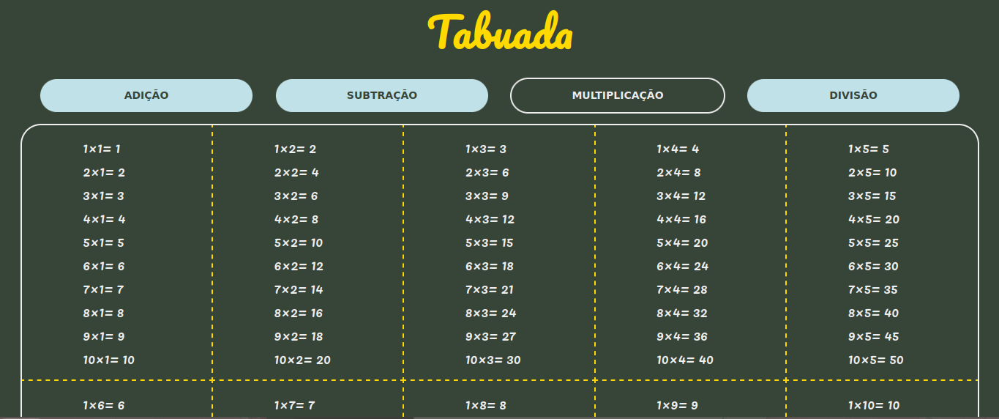
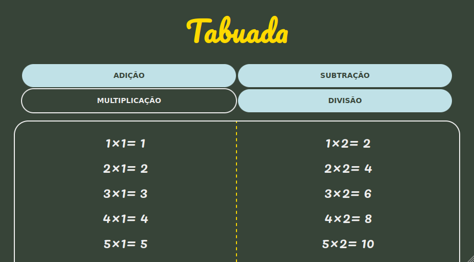
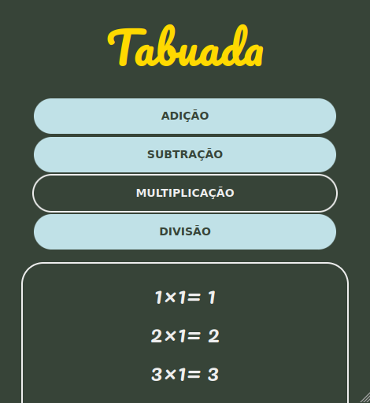

# Tabuada :1234:

Este projeto apresenta dinamicamente a tabuada das 4 operações fundamentais. São utilizados conceitos como *Currying*, *Arrow Functions* além de métodos de *Array*.

## :gear: Tecnologias

- HTML
- CSS
- JavaScript

## :art: Layout

